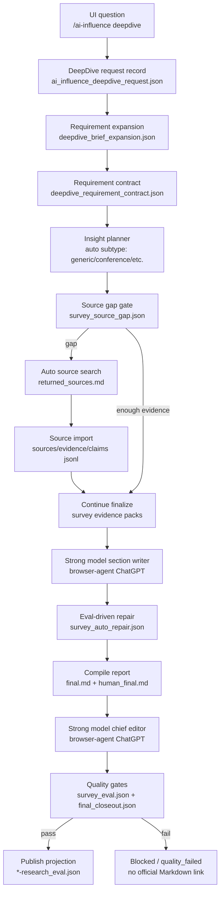

# AI Influence DeepDive Insight Flow

This document records the report-production control flow used by the AI Influence DeepDive entrypoint.

## Topology



## Node Contract And Operators

```text
┌────┬──────────────────────┬──────────────────────────────────────┬──────────────────────────────┬────────────────────────────────────┐
│ ID │ Node                 │ Operator / implementation            │ Input                        │ Output                             │
├────┼──────────────────────┼──────────────────────────────────────┼──────────────────────────────┼────────────────────────────────────┤
│ A  │ UI question          │ AIInfluenceDeepDiveEntrypoint        │ user question                │ POST /ai-influence/deepdive        │
│ B  │ Request record       │ _ai_influence_deepdive_create        │ question, sid, run_dir       │ ai_influence_deepdive_request.json │
│ C  │ Brief expansion      │ DeepDiveBriefExpander                │ raw brief                    │ deepdive_brief_expansion.json      │
│ D  │ Contract compiler    │ DeepDiveRequirementCompiler          │ expanded brief               │ deepdive_requirement_contract.json │
│ E  │ Planner              │ DeepDiveInsightPlanner               │ brief + planner_mode_hint    │ survey_plan/report_ast/source_map  │
│ F  │ Source gap gate      │ DeepDiveSourceGapGate                │ source/evidence/claim jsonl  │ survey_source_gap.json/handoff     │
│ G  │ Auto source search   │ DeepDiveAutoSourceCollector          │ gap, brief, provider         │ returned_sources.md                │
│ H  │ Import results       │ DeepDiveSourceImporter               │ returned_sources.md          │ sources/evidence/claims jsonl      │
│ I  │ Evidence packs       │ DeepDiveEvidencePackBuilder          │ AST + ledgers                │ survey_evidence_packs.json         │
│ J  │ Section writer       │ BrowserAgentChatGPTSurveyWriter      │ evidence packs + prompt pkt  │ sections/*/final.md                │
│ K  │ Auto repair          │ DeepDiveAutoRepair + same writer     │ eval issues                  │ survey_auto_repair.json            │
│ L  │ Compiler             │ DeepDiveReportCompiler               │ section finals               │ final.md/human_final.md/html       │
│ M  │ Chief editor         │ BrowserAgentChiefInsightEditor       │ human_final.md + model       │ chief_editor_final.md              │
│ N  │ Quality gates        │ DeepDiveQualityGate                  │ all artifacts                │ survey_eval/final_closeout         │
│ O  │ Publish projection   │ DeepDiveArtifactPublisher            │ passed chief-editor report   │ *-research_eval.json               │
│ P  │ Blocked state        │ DeepDiveBlockedProjection            │ failed gate payload          │ visible error status               │
└────┴──────────────────────┴──────────────────────────────────────┴──────────────────────────────┴────────────────────────────────────┘
```

## Hard Rules

```text
┌──────────────────────────────────┬────────┬────────────────────────────────────────────────────┐
│ Rule                             │ Status │ Enforcement                                         │
├──────────────────────────────────┼────────┼────────────────────────────────────────────────────┤
│ AI Influence DeepDive is insight │ ok     │ --planner-mode-hint insight                         │
│ Conference is only a subtype     │ ok     │ planner detects conference_insight from query        │
│ Source gaps fail closed          │ ok     │ source_gap_handoff_required before writing           │
│ Auto source cannot fake evidence │ ok     │ no_online_sources_found when provider returns empty   │
│ Section writer uses strong model │ ok     │ --writer-backend browser-agent-chatgpt               │
│ Chief editor uses strong model   │ ok     │ --narrative-backend browser-agent-chatgpt            │
│ Deterministic insight cannot pass│ ok     │ survey_insight_writer_gate.json                      │
│ Bad historical runs show failure │ ok     │ quality_failed hides official Markdown link           │
└──────────────────────────────────┴────────┴────────────────────────────────────────────────────┘
```

## Deterministic Vs Model Boundary

```text
┌────────────────────────────┬──────────────────────┬──────────────────────────────────────────────┐
│ Stage                      │ Allowed mode         │ Reason                                       │
├────────────────────────────┼──────────────────────┼──────────────────────────────────────────────┤
│ Expansion / contract / AST │ deterministic        │ schema, traceability, repeatable planning    │
│ Source gap / ledgers       │ deterministic gate   │ prevents fake evidence                       │
│ Section writing            │ browser-agent model  │ needs synthesis, judgment, and prose quality │
│ Repair writing             │ browser-agent model  │ must fix semantic issues, not template them  │
│ Chief insight editing      │ browser-agent model  │ final thesis, narrative, and judgment layer  │
│ Final eval / projection    │ deterministic gate   │ fail closed and produce audit artifacts      │
└────────────────────────────┴──────────────────────┴──────────────────────────────────────────────┘
```
